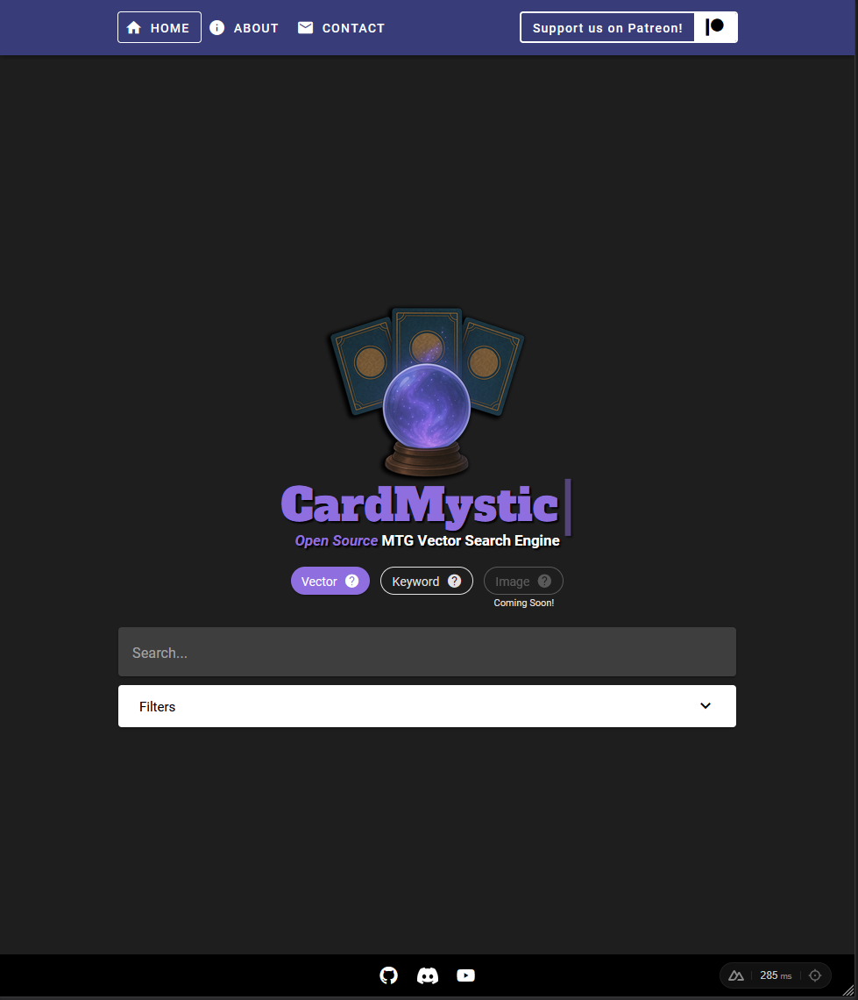
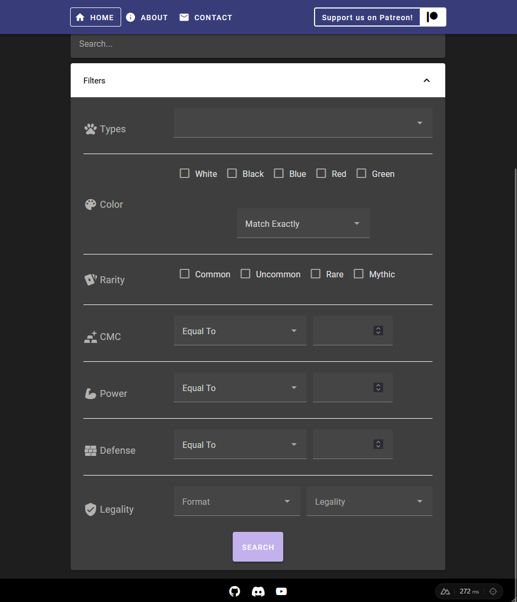
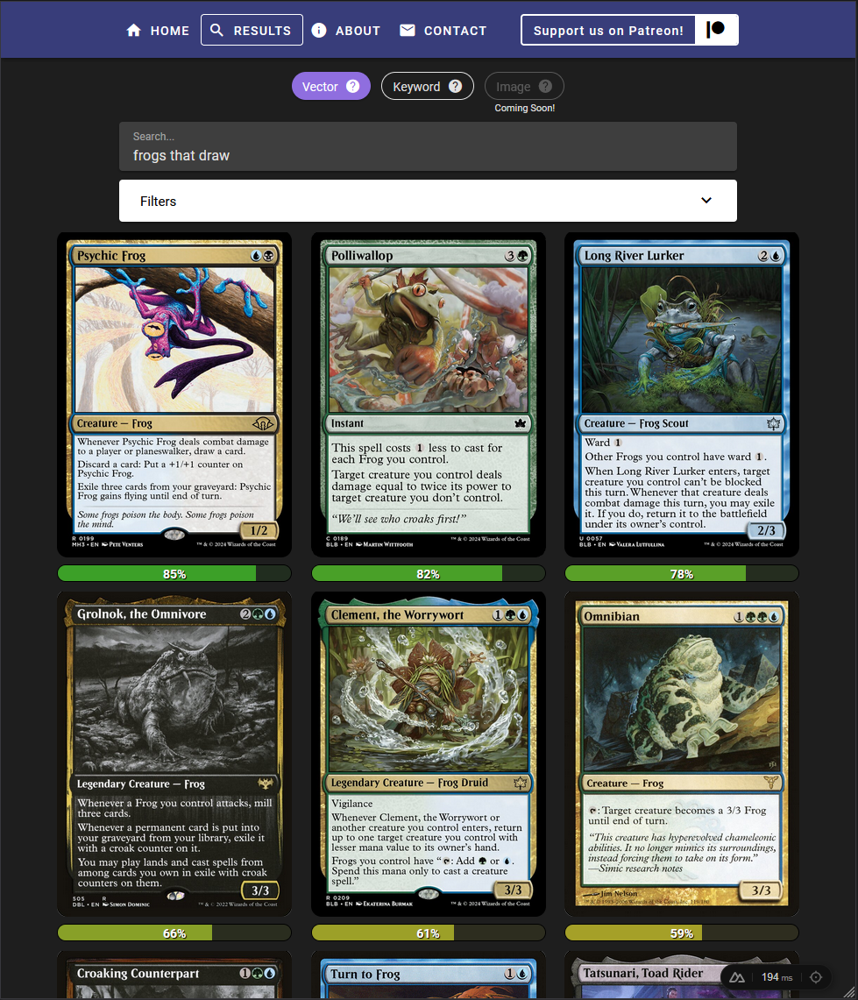
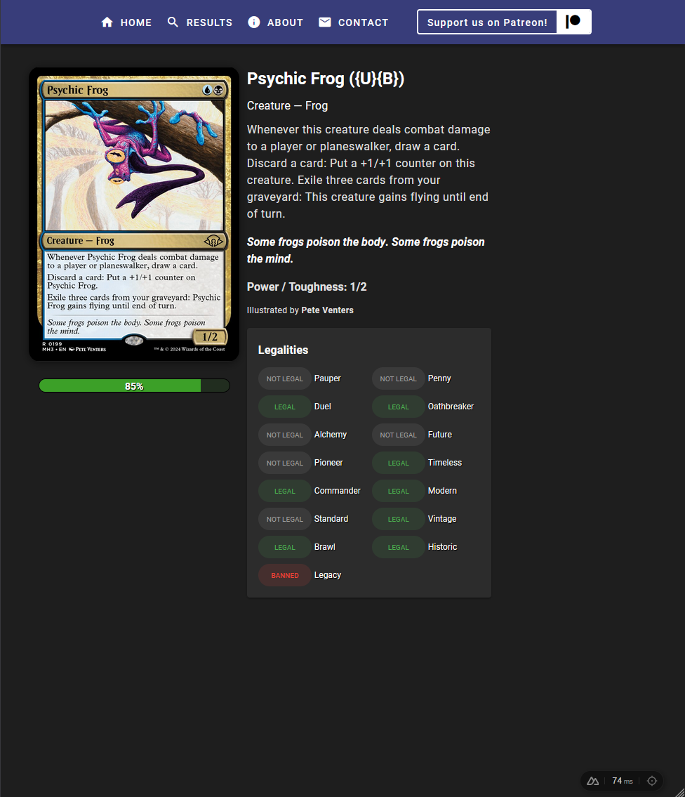

# CardMystic Frontend

[](https://opensource.org/licenses/MIT)
[](https://www.patreon.com/thecardmystic)

🧙‍♂️ Check it out here: [https://cardmystic.com](https://cardmystic.com)

This project is Open Source. The server is kept private for security reasons, but maintains a public API.

This project is an active WIP 🚧

This project uses Vue & Nuxt. Look at the [Nuxt documentation](https://nuxt.com/docs/getting-started/introduction) to learn more.

## ✨ Features

- 🔍 Vector/Semantic search for MTG cards
- 👁️ See the model's Confidence for each result
  - Confidence reflects how strongly the model believes a card matches your search. A higher percentage means a closer match to your query.
- 💪 NLP enhanced properties
- 🧙 Filter by colors, types, CMC, power/toughness, etc.
- 📜 View card details & legalities
- 🛡️ Public API access through proxy WIP 🚧
- 🧪 Hybrid search: semantic + keyword combined
- ⌨️ Traditional Keyword search
- 🖼️ image Search WIP 🚧

## 🛣️ Roadmap

- Image-based search
- User database integration
- Save searches & prompts
- Save cards for easy export

## 🤝 Contributing

We welcome pull requests and feedback!  
Please read [CONTRIBUTING.md](CONTRIBUTING.md) for setup instructions and coding guidelines.

## 🖥️ Server

The CardMystic server code is kept private and is not contained in this repository. Instead, the frontend connects to the public API through the proxy defined in `server\api\proxy\[...path.ts]`

## 🖼️ Preview

### Home Page



### Filters



### Results



### Card Details



## 🛠️ Setup

Make sure to install dependencies:

```bash
# npm
npm install

# pnpm
pnpm install

# yarn
yarn install

# bun
bun install
```

Configure environment variables (and edit as needed):

```bash
cp .env_defaults .env
```

### Development Server

Start the development server on `http://localhost:3000`:

```bash
# npm
npm run dev

# pnpm
pnpm dev

# yarn
yarn dev

# bun
bun run dev
```

### Production

Build the application for production:

```bash
# npm
npm run build

# pnpm
pnpm build

# yarn
yarn build

# bun
bun run build
```

Locally preview production build:

```bash
# npm
npm run preview

# pnpm
pnpm preview

# yarn
yarn preview

# bun
bun run preview
```

Check out the [deployment documentation](https://nuxt.com/docs/getting-started/deployment) for more information.

## 🚫 Ignored Sets

**CardMystic** is meant for finding magic cards that are relevant to typical casual & competitive players, as well as collectors. Because of this, any joke & test sets are left out.

Any set _containing_ any of the following words (i.e. _Mystery Booster Playtest Cards 2019_ would be caught by _Mystery Booster Playtest Cards_) are ignored

- Unglued
- Unhinged
- Unstable
- Unsanctioned
- Unfinity
- Mystery Booster Playtest Cards
- Happy Holidays
- Ponies: The Galloping
- Hero's Path
- Unknown Event

## 🧪 Hybrid Search

This projects uses [Weaviate's hybrid search](https://weaviate.io/developers/weaviate/search/hybrid) to combine keyword search with vector search.

The score for each card is computed with this algorithm:

final*score = alpha * vector*score + (1 - alpha) * bm25_score

The alpha is adjustable, 1.0 being a pure vector search and 0.0 being a pure keyword search.

The current alpha: **0.7**

## 🧠 Weaviate

The Vector Database for this project is [Weaviate](https://weaviate.io/)

### Weaviate Schema

The schema of the data in Weaviate is shown here. This shows whether each property is vectorized (where it is taken into consideration during a vector search) and filterable.

The fields with NLP in the name are enhanced for Natural Language Processing. This includes altering the text slightly so the vectorization model can better understanding the meaning.

"Property name Is Vectorized" is whether or not the property name is vectorized with the value.

<details>
<summary>Click to view schema table</summary>

<table border="1" style="border-collapse: collapse;">
  <tr style="background-color: black; color: white;">
    <th>Property</th>
    <th>Data Type</th>
    <th>Is Vectorized</th>
    <th>Is Filterable</th>
    <th>Property Name Is Vectorized</th>
  </tr>
  <tr>
    <td style="background-color: white; color: black;">name</td>
    <td style="background-color: white; color: black;">Text</td>
    <td style="background-color: lightgreen; color: black;">Yes</td>
    <td style="background-color: lightcoral; color: black;">No</td>
    <td style="background-color: lightcoral; color: black;">No</td>
  </tr>
  <tr>
    <td style="background-color: white; color: black;">types</td>
    <td style="background-color: white; color: black;">Text</td>
    <td style="background-color: lightgreen; color: black;">Yes</td>
    <td style="background-color: lightgreen; color: black;">Yes</td>
    <td style="background-color: lightcoral; color: black;">No</td>
  </tr>
  <tr>
    <td style="background-color: white; color: black;">subtypes</td>
    <td style="background-color: white; color: black;">Text</td>
    <td style="background-color: lightgreen; color: black;">Yes</td>
    <td style="background-color: lightcoral; color: black;">No</td>
    <td style="background-color: lightcoral; color: black;">No</td>
  </tr>
  <tr>
    <td style="background-color: white; color: black;">supertypes</td>
    <td style="background-color: white; color: black;">Text</td>
    <td style="background-color: lightgreen; color: black;">Yes</td>
    <td style="background-color: lightcoral; color: black;">No</td>
    <td style="background-color: lightcoral; color: black;">No</td>
  </tr>
  <tr>
    <td style="background-color: white; color: black;">manaCost</td>
    <td style="background-color: white; color: black;">Text Array</td>
    <td style="background-color: lightcoral; color: black;">No</td>
    <td style="background-color: lightgreen; color: black;">Yes</td>
    <td style="background-color: lightcoral; color: black;">No</td>
  </tr>
  <tr>
    <td style="background-color: white; color: black;">manaCostNLP</td>
    <td style="background-color: white; color: black;">Text Array</td>
    <td style="background-color: lightgreen; color: black;">Yes</td>
    <td style="background-color: lightcoral; color: black;">No</td>
    <td style="background-color: lightcoral; color: black;">No</td>
  </tr>
  <tr>
    <td style="background-color: white; color: black;">cardColors</td>
    <td style="background-color: white; color: black;">Text</td>
    <td style="background-color: lightcoral; color: black;">No</td>
    <td style="background-color: lightgreen; color: black;">Yes</td>
    <td style="background-color: lightcoral; color: black;">No</td>
  </tr>
  <tr>
    <td style="background-color: white; color: black;">cardColorsLength</td>
    <td style="background-color: white; color: black;">Number</td>
    <td style="background-color: lightcoral; color: black;">No</td>
    <td style="background-color: lightcoral; color: black;">No</td>
    <td style="background-color: lightcoral; color: black;">No</td>
  </tr>
  <tr>
    <td style="background-color: white; color: black;">colorIdentity</td>
    <td style="background-color: white; color: black;">Text</td>
    <td style="background-color: lightcoral; color: black;">No</td>
    <td style="background-color: lightcoral; color: black;">No</td>
    <td style="background-color: lightcoral; color: black;">No</td>
  </tr>
  <tr>
    <td style="background-color: white; color: black;">convertedManaCost</td>
    <td style="background-color: white; color: black;">Number</td>
    <td style="background-color: lightcoral; color: black;">No</td>
    <td style="background-color: lightgreen; color: black;">Yes</td>
    <td style="background-color: lightcoral; color: black;">No</td>
  </tr>
  <tr>
    <td style="background-color: white; color: black;">convertedManaCostNLP</td>
    <td style="background-color: white; color: black;">Text</td>
    <td style="background-color: lightgreen; color: black;">Yes</td>
    <td style="background-color: lightcoral; color: black;">No</td>
    <td style="background-color: lightcoral; color: black;">No</td>
  </tr>
  <tr>
    <td style="background-color: white; color: black;">rarity</td>
    <td style="background-color: white; color: black;">Text</td>
    <td style="background-color: lightcoral; color: black;">No</td>
    <td style="background-color: lightgreen; color: black;">Yes</td>
    <td style="background-color: lightcoral; color: black;">No</td>
  </tr>
  <tr>
    <td style="background-color: white; color: black;">rarityNLP</td>
    <td style="background-color: white; color: black;">Text</td>
    <td style="background-color: lightgreen; color: black;">Yes</td>
    <td style="background-color: lightcoral; color: black;">No</td>
    <td style="background-color: lightcoral; color: black;">No</td>
  </tr>
  <tr>
    <td style="background-color: white; color: black;">setCode</td>
    <td style="background-color: white; color: black;">Text</td>
    <td style="background-color: lightcoral; color: black;">No</td>
    <td style="background-color: lightgreen; color: black;">Yes</td>
    <td style="background-color: lightcoral; color: black;">No</td>
  </tr>
  <tr>
    <td style="background-color: white; color: black;">setName</td>
    <td style="background-color: white; color: black;">Text</td>
    <td style="background-color: lightcoral; color: black;">No</td>
    <td style="background-color: lightgreen; color: black;">Yes</td>
    <td style="background-color: lightcoral; color: black;">No</td>
  </tr>
  <tr>
    <td style="background-color: white; color: black;">setNameNLP</td>
    <td style="background-color: white; color: black;">Text</td>
    <td style="background-color: lightgreen; color: black;">Yes</td>
    <td style="background-color: lightcoral; color: black;">No</td>
    <td style="background-color: lightcoral; color: black;">No</td>
  </tr>
  <tr>
    <td style="background-color: white; color: black;">cardText</td>
    <td style="background-color: white; color: black;">Text</td>
    <td style="background-color: lightgreen; color: black;">Yes</td>
    <td style="background-color: lightcoral; color: black;">No</td>
    <td style="background-color: lightcoral; color: black;">No</td>
  </tr>
  <tr>
    <td style="background-color: white; color: black;">flavorText</td>
    <td style="background-color: white; color: black;">Text</td>
    <td style="background-color: lightcoral; color: black;">No</td>
    <td style="background-color: lightcoral; color: black;">No</td>
    <td style="background-color: lightcoral; color: black;">No</td>
  </tr>
  <tr>
    <td style="background-color: white; color: black;">power</td>
    <td style="background-color: white; color: black;">Number</td>
    <td style="background-color: lightgreen; color: black;">Yes</td>
    <td style="background-color: lightcoral; color: black;">No</td>
    <td style="background-color: lightcoral; color: black;">No</td>
  </tr>
  <tr>
    <td style="background-color: white; color: black;">powerNLP</td>
    <td style="background-color: white; color: black;">Text</td>
    <td style="background-color: lightcoral; color: black;">No</td>
    <td style="background-color: lightgreen; color: black;">Yes</td>
    <td style="background-color: lightcoral; color: black;">No</td>
  </tr>
  <tr>
    <td style="background-color: white; color: black;">toughness</td>
    <td style="background-color: white; color: black;">Number</td>
    <td style="background-color: lightcoral; color: black;">No</td>
    <td style="background-color: lightgreen; color: black;">Yes</td>
    <td style="background-color: lightcoral; color: black;">No</td>
  </tr>
  <tr>
    <td style="background-color: white; color: black;">toughnessNLP</td>
    <td style="background-color: white; color: black;">Text</td>
    <td style="background-color: lightgreen; color: black;">Yes</td>
    <td style="background-color: lightcoral; color: black;">No</td>
    <td style="background-color: lightcoral; color: black;">No</td>
  </tr>
  <tr>
    <td style="background-color: white; color: black;">artist</td>
    <td style="background-color: white; color: black;">Text</td>
    <td style="background-color: lightcoral; color: black;">No</td>
    <td style="background-color: lightgreen; color: black;">Yes</td>
    <td style="background-color: lightcoral; color: black;">No</td>
  </tr>
  <tr>
    <td style="background-color: white; color: black;">url</td>
    <td style="background-color: white; color: black;">Text</td>
    <td style="background-color: lightcoral; color: black;">No</td>
    <td style="background-color: lightcoral; color: black;">No</td>
    <td style="background-color: lightcoral; color: black;">No</td>
  </tr>
  <tr>
    <td style="background-color: white; color: black;">legalityIn${FormatName}Format</td>
    <td style="background-color: white; color: black;">Text</td>
    <td style="background-color: lightgreen; color: black;">Yes</td>
    <td style="background-color: lightgreen; color: black;">Yes</td>
    <td style="background-color: lightgreen; color: black;">Yes</td>
  </tr>
</table>

</details>

## 🙏 Acknowledgements

- [Scryfall](https://scryfall.com/) for inspiration
- [MTGJson](https://mtgjson.com/) for card data
